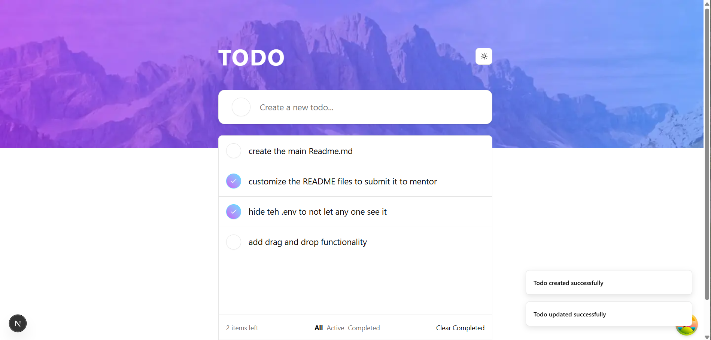
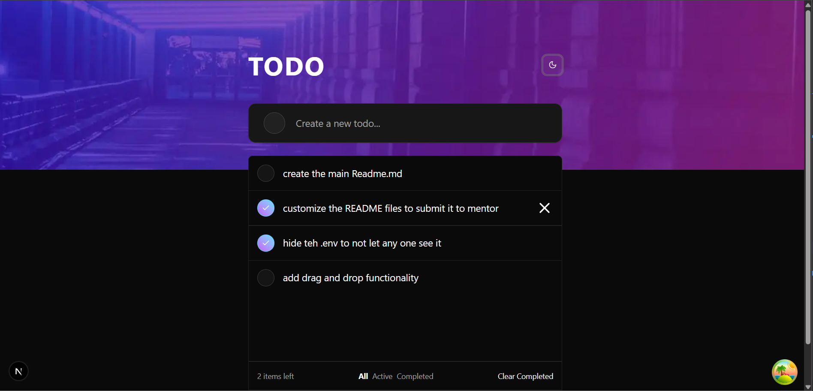

# Frontend Mentor - Todo app solution

This is a solution to the [Todo app challenge on Frontend Mentor](https://www.frontendmentor.io/challenges/todo-app-Su1_KokOW). Frontend Mentor challenges help you improve your coding skills by building realistic projects.

## Table of contents

- [Overview](#overview)
  - [The challenge](#the-challenge)
  - [Screenshot](#screenshot)
  - [Links](#links)
- [My process](#my-process)
  - [Built with](#built-with)
  - [What I learned](#what-i-learned)
  - [Continued development](#continued-development)
  - [Useful resources](#useful-resources)
- [Author](#author)
- [Acknowledgments](#acknowledgments)

## Overview

### The challenge

Users should be able to:

- View the optimal layout for the app depending on their device's screen size
- See hover states for all interactive elements on the page
- Add new todos to the list
- Mark todos as complete
- Delete todos from the list
- Filter by all/active/complete todos
- Clear all completed todos
- Toggle light and dark mode
- **Bonus**: Drag and drop to reorder items on the list

### Screenshot





### Links

- Solution URL: [GitHub](https://github.com/abdallemad/mentor-todo-app-fullstack)
- Live Site URL: [Live](https://mentor-todo-app-fullstack.vercel.app/)

## My process

- First analyze the challenge and the design
- create a product backlog in [Notion](https://www.notion.so/)
- Start by design a database and create a Prisma schema
- Create a Next.js project and install the required dependencies
- Create a Clerk account and add it to the project
- set up a connection to mongodb
- create a React Query hooks for fetching and mutating data
- create server action for each action under actions folder
- then add drag and drop functionality using motion from framer-motion

### Built with

- Next.js
- Tailwind CSS
- Shadcn UI
- React Query
- Clerk
- Framer Motion
- Mobile-first workflow
- [React](https://reactjs.org/) - JS library
- [Next.js](https://nextjs.org/) - React framework
- [Tailwind CSS](https://tailwindcss.com/) - For styles
- [Shadcn UI](https://ui.shadcn.com/) - For components
- [Prisma](https://www.prisma.io/) - For database
- [React Query](https://tanstack.com/query/v5) - For data fetching
- [Clerk](https://clerk.dev/) - For authentication
- [Framer Motion](https://www.framer.com/motion/) - For animations

### What I learned

- drag and drop functionality : [Drag and drop using framer motion](https://www.youtube.com/watch?v=O5lZqqy7VQE&t=264s)
- how to split the hooks in separated files

```typescript
export function useDeleteTodo({ queryClient }: { queryClient: QueryClient }) {
  const { mutate: deleteTodo, isPending: deleteTodoLoading } = useMutation({
    mutationFn: deleteTodoAction,
    onSuccess: () => {
      queryClient.invalidateQueries({
        queryKey: ["todos"],
      });
      toast("Todo deleted successfully", {
        action: "Ok",
        duration: 4000,
      })
    },
    onError: () => {
      toast("Todo deleted failed", {
        action: "Ok",
        duration: 4000,
      })
    },
  });
  return { deleteTodo, deleteTodoLoading };
```

### Useful resources

- [Drag and Drop Video](https://www.youtube.com/watch?v=O5lZqqy7VQE&t=264s) - This helped me for drag and drop functionality.


## Author

- Website - [Abdellah Elmadani](https://abdallahemad.vercel.app)
- Frontend Mentor - [@abdallemad](https://www.frontendmentor.io/profile/abdallemad)
- GitHub - [@abdallemad](https://github.com/abdallemad)

## Acknowledgments

This is where you can give a hat tip to anyone who helped you out on this project. Perhaps you worked in a team or got some inspiration from someone else's solution. This is the perfect place to give them some credit.
